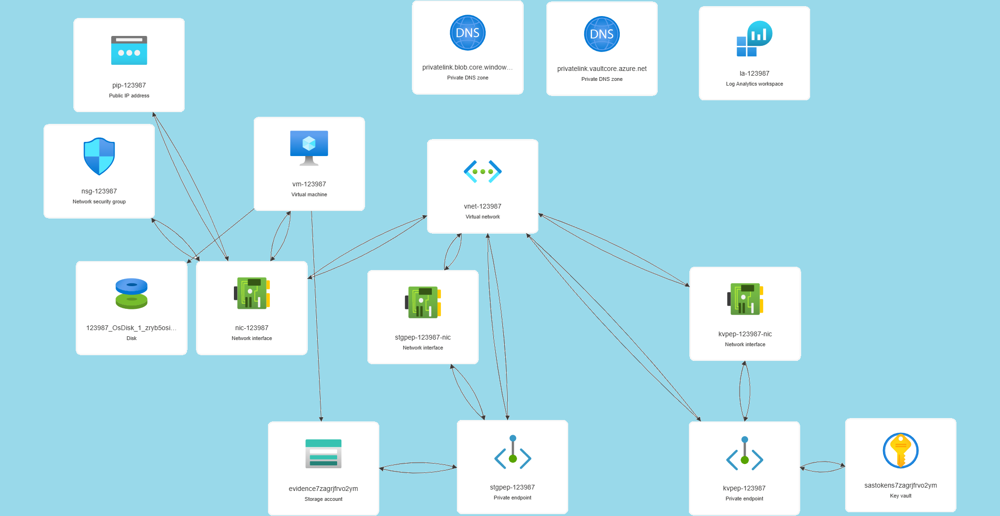
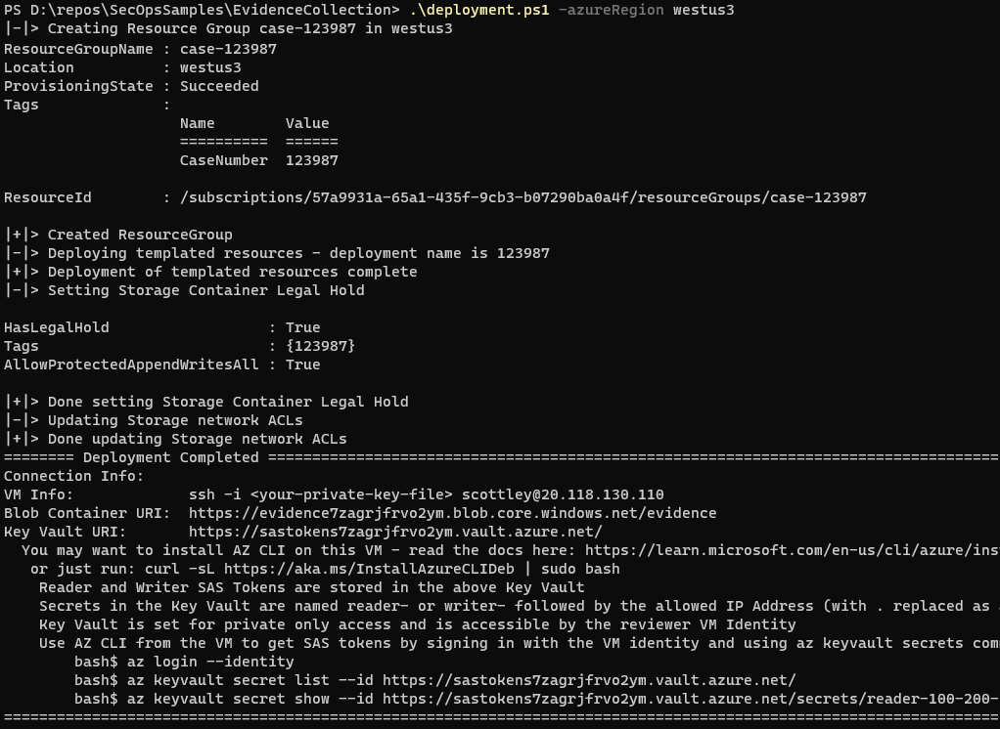

# Evidence Collection Environment

This environment is intended to be useful for when you have multiple investigators or external parties adding data for evaluation. Some key features (hopefully) implemented in this setup leverage the [Azure Storage legal hold](https://learn.microsoft.com/en-us/azure/storage/blobs/immutable-legal-hold-overview), [Azure Storage analytics logging](https://learn.microsoft.com/en-us/azure/storage/common/storage-analytics-logging) for validation of access by which parties, [Azure Key Vault logging](https://learn.microsoft.com/en-us/azure/key-vault/general/logging?tabs=Vault) with the logs going to a Log Analytics workspace in the resource group. 



The reasoning behind deploying a VM is to create an analysis environment that lives within the trust boundary - consider a case where you have a compromise of a machine that had customer data on it, you may not be able to bring customer data outside the compliance boundary.

To deploy this:
1. clone this repo or download the files,
2. review the descriptions in the template.json parameters
```json
{
"parameters":  {
        "caseNumber": { 
            "type": "string",
            "minLength": 1,
            "maxLength": 20,
            "metadata": { "description": "the case identifier you are working - this is used to tag all resources and generate a unique storage account name" }
        },
        "adminName": {
            "type": "string",
            "defaultValue": "vmAdmin",
            "metadata": { "description": "the VM admin login name." }
        },
        "adminSshPublicKey": { 
            "type": "string",
            "metadata": { "description": "the VM admin SSH public key" }
        },
        "adminIpAddress": {
            "type": "string",
            "metadata": { "description": "the VM admin's source IP Address." }
        },
        "allowAdminToAccessKeyVault": {
            "type": "bool",
            // allow admin to connect to vault by public IP... balancing usability versus forcing login to VM.
            "metadata": { "description": "Set this to true if you want your admin to be able to access Key Vault from Azure interfaces (az cli, portal, etc...) and not just from the VM" },
            "defaultValue": false
        },
        "writerIpAddresses": {
            "type": "array",
            "metadata": { "description": "If you are allowing a remote user to upload data, specify this address" }
        },
        "readerIpAddresses": {
            "type": "array",
            "metadata": { "description": "If you are allowing a remote user to download data, specify this address" }
        },
        "utcNow":{
            "type":"string",
            "defaultValue": "[utcNow('u')]"
        },
        "tokenExpirationInDays": {
            "type": "int",
            "defaultValue": 90,
            "metadata": {
                "description": "days until reader and writer SAS tokens expire"
            }
        },
        "vnetAddressSpace": {
            "type":"string",
            "defaultValue": "172.16.128.0/24",
            "metadata": {
                "description": "use this value to control the address space of the VMs VNet."
            }
        },
        "vmImageReference": {
            "type": "object", 
            "metadata": {
                "description": "Use this default or specify an image reference of yoru choice"
            },
            "defaultValue": {
                "publisher": "canonical",
                "offer": "0001-com-ubuntu-server-jammy",
                "sku": "22_04-lts-gen2",
                "version": "latest"
            }
        },
        "vmDiskSizeInGb": {
            "type": "int",
            "metadata": {
                "description": "VM OS Disk Size in GB - default is 30GB"
            },
            "defaultValue": 30
        }
    }
}
```
3. update the values in parameters.json 
```json
{
    "$schema": "https://schema.management.azure.com/schemas/2015-01-01/deploymentParameters.json#",
    "contentVersion": "1.0.0.0",
    "parameters": {
        "caseNumber": {
            "value": "123986"
        },
        "adminName": {
            "value": "scottley"
        },
        "adminSshPublicKey": {
            "value": "ssh-rsa AAAAB3NzaC1yc2EAAAADAQABAAABgQDhesuX2ru+tr0xzj/PGkH3OhrFwiHQm7BEnRBBdbWjaBUVA46TdvxRa5WLze9hDR04pOOcAxrnkxpfYT+e/NLig/eh79NMXUV3ZctVv1AWPC8Dk/9azkR6K6fUPr6KUC3InkDSvze85eMkQtS6izyM0eooU2f7uflVYm+o9nE9ILwJR7xh2o1q4fcVmfnYDRmr16Dppo1rQQRqUuERgwsS/o2Qa3lsyXuWMLhN6wS1JCgO4KWjBZjN/k6boUrBAP3F60CyhkoNnwk+BJpuKS4mAkI1m0yjsHlLJEnWdJgMBJts9I7jgI8yvUf6UKffd6Oxyzyn+iNAxJHr6j7nBMXwkTasMwDSQsS9/RhK2girSuo95qBOzywqZ0KDmyldWmnBniTEtMavEeYTj8bXa+KcmFdJATfTSutK2h/liIRSueEILqTQqzPItwbBIp+vjs/Tw5afr9aRTSLn/jucU6D3arlwl72UpGPTpC1kkgtdOcESFew2asQDjoFk8k6iUS0= generated-by-azure"
        },
        "adminIpAddress": {
            "value": "73.140.112.227"
        },
        "allowAdminToAccessKeyVault": {
            "value": true
        },
        "readerIpAddresses": {
            "value": ["73.140.112.227"]
        },
        "writerIpAddresses": {
            "value": ["73.140.112.227"]
        }
    }
}
```
4. Run the deployment PowerShell script specifying an Azure Region parameter
```PowerShell
# works with either "name" or "friendly name"
#    e.g., "East US 2". Note quotes are required with friendly name
PS> .\deployment.ps1 -azureRegion eastus2 
```

